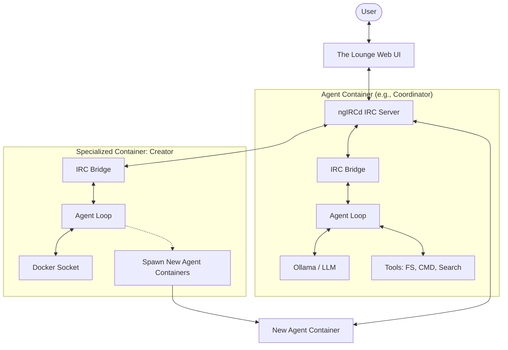

# HomeAgent

This is a PoC in much the same style as OpenClaw/TinyClaw,NanoClaw, but using IRC as the communication channel. This allows us to have passwords/TLS on communications without having to rely on [Large Company Chat Solution]. It also opens up the possibility of having several agents running from different servers collaboratively working on a task via the same IRC network. Why IRC? Because I'm old and remember using it a lot and it _just works_. However I've tried to separate the communication medium from the agents, opening up the possibility of moving to Jabber or other solutions in future, like [proprietary chat solution].

All of this is is targeting self-hosting for the moment, just to keep costs down (except for hardware, unfortunately).

Each agent is it's own Docker container, it has a PERSONALITY.md, and a metadata.json that allows each agent to respond to a few key words in the channel. This is to keep token usage down as not all agents need to parse every incoming message. When an agent picks up a message they should recieve the context of the conversation also in case it's missing directly in the message itself (such as when one agent passes a user request to another agent).

Currently each agent has access to some tools, and the ability to run python code or shell commands in it's own container. There is a shared volume that allows agents to pass files to each other that wouldn't fit in an IRC message.

This is absolutely a work in progress.

An example of how this all works:
```
11:07 <user_30> I'd like someone who is an expert in eBPF
11:07 <coordinator> @Creator, please build a specialist agent to handle eBPF queries.
11:07 <creator> Agent eBPFExpert has been created and is ready to assist.
11:07 *** eBPFExpert (~eBPFExpert@agent-ebpfexpert.homeagent_default) has joined the channel
11:07 <eBPFExpert> Hello, i'm eBPFExpert, I'm here to help you with **Identity**: I am an expert on eBPF (extended Berkeley Packet Filter) technology, including its use for tracing, networking, security, and performance monitoring
11:08 <user_30> eBPFExpert - how can I create an eBPF program in a docker container when I don't know the target kernel version?
11:08 <eBPFExpert> **TL;DR**
11:08 <eBPFExpert> If you don’t know the exact kernel version that the Docker container will run on, the safest way to build an eBPF program is to compile *inside* the container against the **host’s kernel headers** (or a header tree that matches the host).  The steps are:
```
And it carries on with the rest of the conversation...
```

## System Requirements

- **Docker & Docker Compose**: Essential for running the isolated agent containers and system network.
- **Ollama**: Required locally or remotely to provide the LLM backend.
- **Searxng**: (Optional but recommended) Required to utilize the Web Search tool.

## Architecture

The system follows a hub-and-spoke architecture with an IRC server at the center. Each agent is isolated in its own Docker container and communicates via standard IRC protocols.



### Core Components
- **IRC Server (`ircserver`)**: The central communication bus (ngIRCd).
- **The Lounge (`thelounge`)**: A modern web-based IRC client for human-to-agent interaction.
- **Coordinator Agent**: The primary fallback agent for delegation and general questions.
- **Creator Agent**: A systems administrator agent that manages the ecosystem by spawning new agent containers.

## Agent Infrastructure

Every agent in the HomeAgent ecosystem runs as an independent, isolated container. This isolation ensures that one agent's environment or dependencies do not interfere with another's.

### The Container Model
Each agent container follows a dual-process architecture:
1. **IRC Bridge (`irc_bridge.py`)**: A lightweight wrapper that connects to the IRC server, handles message routing (mentions, keywords), and bridges IRC messages to the agent's `stdin`/`stdout`.
2. **Agent Loop (`agent_loop.py`)**: The primary execution environment where the LLM processes messages and executes tools (File System, Command Execution, Web Search).

### Dynamic Spawning
The **Creator** agent is uniquely privileged with access to the Docker socket (`/var/run/docker.sock`). When a new agent is requested, the Creator:
1. Generates a personality and metadata (`metadata.json`, `PERSONALITY.md`).
2. Persists these to a shared directory.
3. Uses the Docker API to pull the `Dockerfile.agent` and spin up a new container linked to the common IRC network.

## Getting Started

1. **Clone the repository:**
   ```bash
   git clone <repository-url>
   cd HomeAgent
   ```

2. **Configure your Environment:**
   Copy the `.env-example` file to create your own localized `.env` file:
   ```bash
   cp .env-example .env
   ```
   Modify the `.env` file with your preferred IRC Server, Ollama Host, and Searxng URL endpoints.

3. **Start the Agent Ecosystem:**
   Use Docker Compose to build and start the network:
   ```bash
   docker compose up -d --build
   ```

## Interacting with the Agents

Once the containers are running, you can chat with the agents using the built-in web client!

1. Open your browser to The Lounge at [http://localhost:9000](http://localhost:9000).
2. Connect to the default server (it should be pre-configured to connect to `ircserver:6667`).
3. Join the `#agents` channel.
4. Say hello to the system!

### Delegating Tasks
You can address specific agents by mentioning them. If you aren't sure who to talk to, ask the Coordinator:
- `"@Coordinator what is the weather like today?"`

### Creating New Agents
You can ask the Creator to spin up entirely new, containerized agents on the fly! The Creator will invent a personality, save it to disk, and instantiate a new Docker container. 
- `"@Creator please build me a new agent called PythonExpert to help me write Python scripts."`

The Creator will process the request and you'll see the new agent join the IRC channel shortly after.

## Development

Agents define their personality and runtime metadata in `data/agents/<AgentName>/`. 

When the `Creator` agent boots, it automatically runs a **Sync** process. If it detects any agent configurations on disk that don't have a corresponding running Docker container, it will automatically spawn them for you!

## Future Roadmap

The ecosystem is continuously evolving. Key focus areas for future development include:

### Kubernetes Integration (Agent Operator)
Transitioning the dynamic spawning logic from Docker-specific commands to a **Kubernetes Operator**. This will allow the Creator to work with the K8s API to manage agents as Custom Resources (CRDs), enabling better scaling and resilience across a cluster.

### Secure Secret Management
A robust method to provide secrets or other sensitive data (e.g., GitHub deploy keys, API keys) to agents outside of the public chat interface.
- **Proposed approach**: Integration with K8s Secrets, HashiCorp Vault, or an encrypted local credential store that agents can query securely when needed.

### Inter-Agent Collaboration
Enhancing the ability for agents to form "swarms" to tackle complex, multi-step engineering tasks autonomously.
